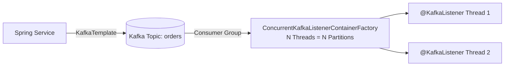

## Question

Explain Spring for Apache Kafka: `KafkaTemplate`, `@KafkaListener`, consumer concurrency, offset commit management (AckMode), error handling with `DefaultErrorHandler`, retry topic pattern, and Dead Letter Queues (DLQ).

## Answer

**Spring for Apache Kafka Architecture:**
Spring Kafka wraps Apache Kafka native Java clients with Spring abstractions, providing listener containers (`ConcurrentKafkaListenerContainerFactory`) and template abstractions (`KafkaTemplate`).



**1. Producer Configuration & `KafkaTemplate`:**
```java
@Service
public class OrderEventProducer {
    private final KafkaTemplate<String, OrderEvent> kafkaTemplate;

    public OrderEventProducer(KafkaTemplate<String, OrderEvent> kafkaTemplate) {
        this.kafkaTemplate = kafkaTemplate;
    }

    public CompletableFuture<SendResult<String, OrderEvent>> sendOrderEvent(String key, OrderEvent event) {
        // Send asynchronously returning CompletableFuture
        return kafkaTemplate.send("orders.v1", key, event)
                .whenComplete((result, ex) -> {
                    if (ex == null) {
                        log.info("Sent event to partition {} offset {}",
                                result.getRecordMetadata().partition(),
                                result.getRecordMetadata().offset());
                    } else {
                        log.error("Failed to send event key {}", key, ex);
                    }
                });
    }
}
```

**2. Consumer Configuration & `@KafkaListener`:**
```java
@Component
public class OrderEventConsumer {

    @KafkaListener(
        topics = "orders.v1",
        groupId = "inventory-service-group",
        concurrency = "3" // Spawns 3 concurrent consumer threads
    )
    public void consume(ConsumerRecord<String, OrderEvent> record, Acknowledgment ack) {
        log.info("Received event key={} from partition={}", record.key(), record.partition());
        
        processOrder(record.value());
        
        ack.acknowledge(); // Manual commit when ContainerAckMode = MANUAL_IMMEDIATE
    }
}
```

**3. Offset Commit Modes (`ContainerProperties.AckMode`):**
- `BATCH` (default): Commits offsets after all records returned by `poll()` are processed.
- `RECORD`: Commits offset after each individual record is processed.
- `MANUAL_IMMEDIATE`: Application explicitly calls `Acknowledgment.acknowledge()`, committing offset instantly.

**4. Error Handling, Retries & Dead Letter Queue (DLQ):**
When a consumer throws an exception, Spring Kafka can automatically retry with exponential backoff and publish failed messages to a `.DLT` (Dead Letter Topic).

```java
@Configuration
public class KafkaConsumerConfig {

    @Bean
    public DefaultErrorHandler errorHandler(KafkaTemplate<String, Object> template) {
        // Publish to DLT (Dead Letter Topic: <original_topic>.DLT) after max retries
        DeadLetterPublishingRecoverer recoverer = new DeadLetterPublishingRecoverer(template);

        // Exponential backoff: 1s, 2s, 4s (max 3 attempts)
        ExponentialBackOffWithMaxRetries backoff = new ExponentialBackOffWithMaxRetries(2);
        backoff.setInitialInterval(1000L);
        backoff.setMultiplier(2.0);

        DefaultErrorHandler errorHandler = new DefaultErrorHandler(recoverer, backoff);
        
        // Non-retryable exceptions (immediately send to DLQ without retry)
        errorHandler.addNotRetryableExceptions(IllegalArgumentException.class);

        return errorHandler;
    }
}
```

**Non-Blocking Retry Topic Pattern (`@RetryableTopic`):**
Blocking retries block partition consumption. `@RetryableTopic` routes failed messages to separate delayed retry topics (`orders-retry-1000`, `orders-retry-2000`) without blocking main topic consumption!

```java
@RetryableTopic(
    attempts = "4",
    backoff = @Backoff(delay = 1000, multiplier = 2.0),
    autoCreateTopics = "true",
    dltStrategy = DltStrategy.FAIL_ON_ERROR
)
@KafkaListener(topics = "orders.v1", groupId = "payment-group")
public void consumeWithRetry(OrderEvent event) {
    paymentService.process(event);
}
```

## Follow-ups

- What happens if a consumer partition assignment causes a rebalance during a long-running message batch?
- How do you configure transactional producers and consumers in Spring Kafka (`@Transactional`) for exactly-once semantics (EOS)?
- What is `ConsumerSeekAware` and how do you reset topic offsets programmatically?
