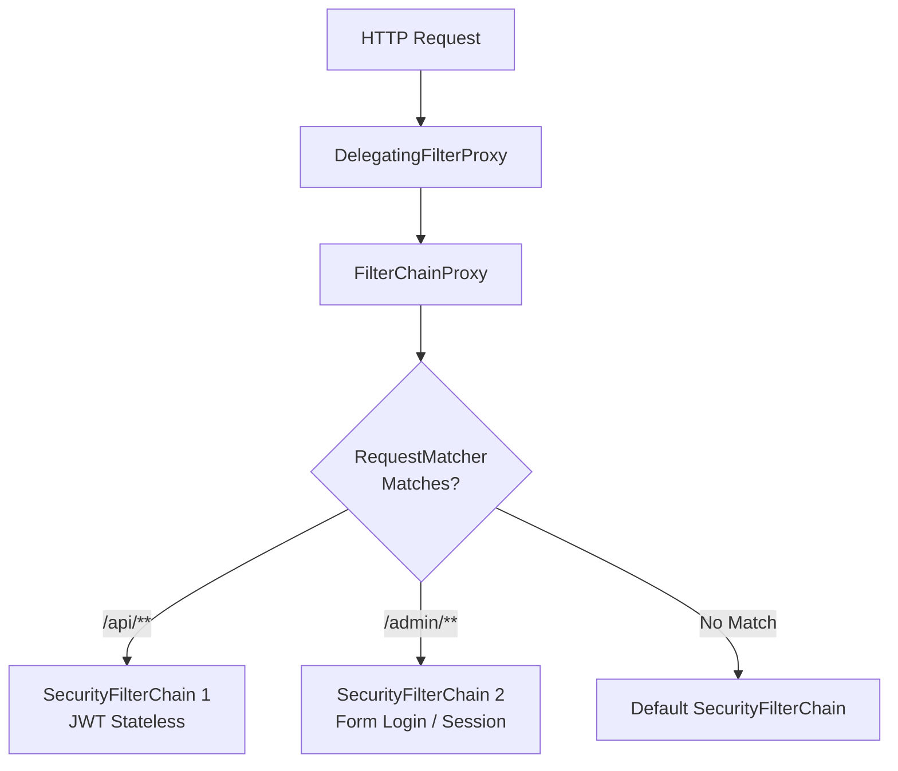

## Question

Explain Spring Security 6 architecture: `WebSecurityCustomizer` vs `SecurityFilterChain`, request matching precedence, custom filter placement (`addFilterBefore`, `addFilterAfter`, `addFilterAt`), and debugging the FilterChain Proxy.

## Answer

**Spring Security Architecture Overview:**
Spring Security integrates into Java Servlet containers via `DelegatingFilterProxy`. This single servlet filter delegates execution to `FilterChainProxy`, which manages one or more `SecurityFilterChain` bean instances.



**1. `WebSecurityCustomizer` (Bypassing Security Entirely):**
Used to completely exclude static assets (images, CSS, JS, favicon) from Spring Security processing.
- **Warning:** Requests matching `WebSecurityCustomizer` bypass ALL security filters — no security context, no authorization headers, no CSRF checks!

```java
@Configuration
@EnableWebSecurity
public class SecurityConfig {

    @Bean
    public WebSecurityCustomizer webSecurityCustomizer() {
        // Completely bypass Spring Security for static assets
        return (web) -> web.ignoring().requestMatchers(
            "/css/**", "/js/**", "/images/**", "/favicon.ico", "/error"
        );
    }
}
```

**2. Multiple `SecurityFilterChain` Beans & `@Order`:**
You can define multiple `SecurityFilterChain` beans. Spring Security evaluates them in order based on the `@Order` annotation until the first matching chain's `securityMatcher` passes.

```java
@Configuration
@EnableWebSecurity
public class MultiChainSecurityConfig {

    // Chain 1: API Endpoints (Order 1 - Evaluated First)
    @Bean
    @Order(1)
    public SecurityFilterChain apiSecurityFilterChain(HttpSecurity http) throws Exception {
        http
            .securityMatcher("/api/**") // Only matches /api/**
            .csrf(csrf -> csrf.disable())
            .sessionManagement(s -> s.sessionCreationPolicy(SessionCreationPolicy.STATELESS))
            .authorizeHttpRequests(auth -> auth
                .requestMatchers("/api/v1/public/**").permitAll()
                .anyRequest().authenticated()
            )
            .oauth2ResourceServer(oauth2 -> oauth2.jwt(Customizer.withDefaults()));

        return http.build();
    }

    // Chain 2: Management / Actuator (Order 2 - Evaluated Second)
    @Bean
    @Order(2)
    public SecurityFilterChain managementSecurityFilterChain(HttpSecurity http) throws Exception {
        http
            .securityMatcher("/actuator/**")
            .authorizeHttpRequests(auth -> auth.anyRequest().hasRole("ADMIN"))
            .httpBasic(Customizer.withDefaults());

        return http.build();
    }
}
```

**3. Custom Filter Order & Placement:**
Custom servlet filters must be inserted into the Spring Security filter chain relative to built-in filters using:
- `addFilterBefore(filter, targetClass)`
- `addFilterAfter(filter, targetClass)`
- `addFilterAt(filter, targetClass)`

```java
@Bean
public SecurityFilterChain filterChain(HttpSecurity http, JwtTokenFilter jwtFilter) throws Exception {
    http
        // Insert custom JWT filter BEFORE standard UsernamePasswordAuthenticationFilter
        .addFilterBefore(jwtFilter, UsernamePasswordAuthenticationFilter.class)
        .authorizeHttpRequests(auth -> auth.anyRequest().authenticated());

    return http.build();
}
```

**Built-In Filter Ordering Reference (Partial List):**
1. `ChannelProcessingFilter` (HTTPS redirect)
2. `WebAsyncManagerIntegrationFilter`
3. `SecurityContextHolderFilter` (Loads SecurityContext)
4. `HeaderWriterFilter` (Adds security response headers)
5. `CorsFilter` (Handles CORS preflight)
6. `CsrfFilter` (Verifies CSRF tokens)
7. `LogoutFilter`
8. `UsernamePasswordAuthenticationFilter` / `BearerTokenAuthenticationFilter`
9. `ConcurrentSessionFilter`
10. `AuthorizationFilter` (Access control check — LAST filter!)

**4. Debugging the Security Filter Chain:**
Enable security debug output to log every request and matching filter chain:

```yaml
# application.yml
logging:
  level:
    org.springframework.security: DEBUG
```

Or enable programmatic debug printing:
```java
@EnableWebSecurity(debug = true) // Prints SecurityFilterChain details in server logs
```

## Follow-ups

- Why is placing `CorsFilter` before `CsrfFilter` and `AuthorizationFilter` mandatory in custom filter chains?
- What is the difference between `SecurityContextPersistenceFilter` (deprecated) and `SecurityContextHolderFilter` in Spring Security 6?
- How does `OncePerRequestFilter` ensure a custom filter executes only once per HTTP request dispatch?
