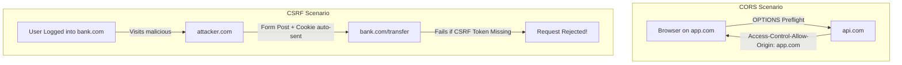

## Question

Explain CORS (Cross-Origin Resource Sharing) and CSRF (Cross-Site Request Forgery): what security vulnerabilities they address, how browser preflight requests (`OPTIONS`) work, SameSite cookies, and how to properly configure both in Spring Security 6.

## Answer

**1. CORS vs CSRF Concepts:**

- **CORS (Browser Access Restriction):** Browser security mechanism that prevents a web page from Domain A (`app.com`) from making AJAX requests to Domain B (`api.com`) unless Domain B explicitly allows it via response headers (`Access-Control-Allow-Origin`).
- **CSRF (Unauthorized Action Forgery):** Attack where a malicious site (`attacker.com`) tricks a user's browser into sending an authenticated HTTP request (with session cookies automatically attached) to a vulnerable site (`bank.com`).



**2. Configuring CORS in Spring Security 6:**
CORS must be handled at the Spring Security filter chain level (before authentication checks), otherwise preflight `OPTIONS` requests will be rejected with 401/403.

```java
@Configuration
@EnableWebSecurity
public class SecurityConfig {

    @Bean
    public SecurityFilterChain filterChain(HttpSecurity http) throws Exception {
        http
            .cors(cors -> cors.configurationSource(corsConfigurationSource()))
            // Other security rules...
            ;
        return http.build();
    }

    @Bean
    public CorsConfigurationSource corsConfigurationSource() {
        CorsConfiguration config = new CorsConfiguration();
        config.setAllowedOrigins(List.of("https://app.example.com", "https://admin.example.com"));
        config.setAllowedMethods(List.of("GET", "POST", "PUT", "DELETE", "OPTIONS"));
        config.setAllowedHeaders(List.of("Authorization", "Content-Type", "X-Requested-With"));
        config.setExposedHeaders(List.of("X-Total-Count"));
        config.setAllowCredentials(true); // Allow sending cookies/auth headers
        config.setMaxAge(3600L); // Cache preflight response for 1 hour

        UrlBasedCorsConfigurationSource source = new UrlBasedCorsConfigurationSource();
        source.registerCorsConfiguration("/**", config);
        return source;
    }
}
```

**3. Configuring CSRF Protection:**

- **When to KEEP CSRF Enabled:** Applications using session cookies / HTTP-only cookies for authentication.
- **When to DISABLE CSRF:** Stateless REST APIs using JWT tokens sent via the `Authorization: Bearer <token>` header (since browsers do NOT automatically attach headers on cross-site requests).

```java
// Stateless REST API Configuration (Disabling CSRF)
http
    .csrf(csrf -> csrf.disable())
    .sessionManagement(s -> s.sessionCreationPolicy(SessionCreationPolicy.STATELESS));
```

```java
// Cookie-Based SPA Configuration (Enabling CSRF with CookieCsrfTokenRepository)
http
    .csrf(csrf -> csrf
        .csrfTokenRepository(CookieCsrfTokenRepository.withHttpOnlyFalse()) // Exposes XSRF-TOKEN cookie to Angular/React
        .csrfTokenRequestHandler(new SpaCsrfTokenRequestHandler()) // Handles SPA token extraction
    );
```

**4. SameSite Cookie Attribute (Modern CSRF Defense):**
Setting `SameSite=Strict` or `SameSite=Lax` on session cookies prevents browsers from sending cookies on cross-site requests, mitigating most CSRF attacks at the browser level.
```yaml
# application.yml
server:
  servlet:
    session:
      cookie:
        same-site: Lax
        secure: true # HTTPS only
        http-only: true # Prevents XSS script access
```

## Follow-ups

- What is the difference between `@CrossOrigin` on a controller vs global Spring Security CORS configuration?
- Why do preflight `OPTIONS` requests fail if CORS is configured only in Spring MVC and not Spring Security?
- How does `CookieCsrfTokenRepository` work with Angular's built-in `HttpClient` XSRF module?
