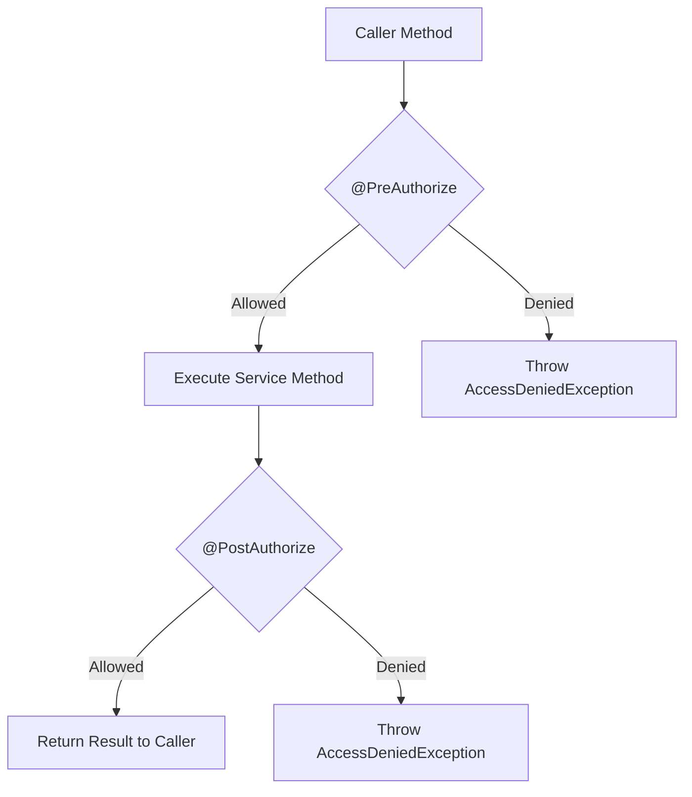

## Question

Explain Spring Security Method-Level Security: `@EnableMethodSecurity`, `@PreAuthorize`, `@PostAuthorize`, `@PreFilter`, `@PostFilter`, custom SpEL security expressions, and performance implications of collection filtering.

## Answer

**What is Method-Level Security?**
While URL-based security (`http.authorizeHttpRequests()`) restricts access at the HTTP endpoint level, Method Security authorizes method execution anywhere in the service/repository layer based on Spring Expression Language (SpEL) expressions.

**1. Enabling Method Security (Spring Security 6+):**
```java
@Configuration
@EnableMethodSecurity // Replaces older @EnableGlobalMethodSecurity(prePostEnabled = true)
public class MethodSecurityConfig {}
```

**2. `@PreAuthorize` vs `@PostAuthorize`:**

- **`@PreAuthorize` (Checked BEFORE method execution):**
Evaluates expression prior to invoking the method. If false, throws `AccessDeniedException` and method DOES NOT run.

```java
@Service
public class DocumentService {

    // Role check
    @PreAuthorize("hasRole('ADMIN')")
    public void deleteAllDocuments() { ... }

    // SpEL evaluating method arguments (#id) and authentication principal
    @PreAuthorize("hasAuthority('DOC_READ') or #ownerId == authentication.principal.id")
    public Document getDocument(Long id, String ownerId) { ... }

    // Custom Bean SpEL evaluation (@myPermissionEvaluator)
    @PreAuthorize("@docSecurity.hasAccess(#docId, 'WRITE')")
    public void updateDocument(Long docId, DocumentDto dto) { ... }
}
```

- **`@PostAuthorize` (Checked AFTER method execution):**
Method runs to completion, then expression evaluates using `returnObject`. If false, throws `AccessDeniedException` and caller DOES NOT receive the return value.

```java
// Execute method, but verify returned document belongs to current user
@PostAuthorize("returnObject.owner == authentication.name or hasRole('ADMIN')")
public Document fetchDocumentById(Long id) {
    return documentRepository.findById(id).orElseThrow();
}
```



**3. `@PreFilter` vs `@PostFilter` (Collection Filtering):**

- **`@PreFilter`:** Filters incoming collection arguments before method runs.
```java
// Removes items from 'documents' collection where user is not the owner
@PreFilter("filterObject.owner == authentication.name")
public void deleteMultipleDocuments(List<Document> documents) {
    documentRepository.deleteAll(documents);
}
```

- **`@PostFilter`:** Filters outgoing returned collection before returning to caller.
```java
// Filters returned List to include only documents the user owns
@PostFilter("filterObject.owner == authentication.name or hasRole('ADMIN')")
public List<Document> getAllDocuments() {
    return documentRepository.findAll();
}
```

**WARNING — `@PostFilter` Performance Pitfall:**
`@PostFilter` executes the database query (`SELECT * FROM documents` returning 100,000 records) into JVM memory first, then iterates over all 100,000 items in Java to filter down to 5 items!
- **Fix:** Move security filtering into the Database SQL query (`WHERE owner = :username`) using Spring Data JPA instead of `@PostFilter`.

**4. Custom Permission Evaluator Bean:**
```java
@Component("docSecurity")
public class DocumentSecurityEvaluator {
    private final DocumentRepository docRepo;

    public DocumentSecurityEvaluator(DocumentRepository docRepo) {
        this.docRepo = docRepo;
    }

    public boolean hasAccess(Long docId, String permission) {
        String currentUser = SecurityContextHolder.getContext().getAuthentication().getName();
        return docRepo.existsByIdAndOwnerAndPermission(docId, currentUser, permission);
    }
}
```

## Follow-ups

- What happens when a method annotated with `@PreAuthorize` is called from within the same Spring bean (self-invocation)?
- How does `SecurityExpressionRoot` provide built-in variables like `principal`, `authentication`, `hasRole()`, `hasAuthority()`?
- How do `@Secured` and `@RolesAllowed` annotations differ from `@PreAuthorize`?
