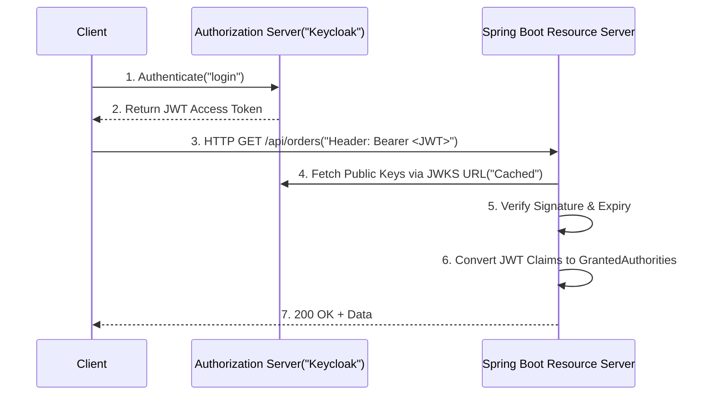

## Question

Explain how to configure Spring Security 6 / Spring Boot 3 as a stateless OAuth2 Resource Server: JWT validation with JWKS (JSON Web Key Set), custom claim converter for roles/authorities, and protecting REST endpoints.

## Answer

**OAuth2 Resource Server Architecture:**
In an OAuth2 architecture (e.g., with Keycloak, Auth0, Okta), the identity provider acts as the **Authorization Server** that issues signed JWT tokens. Your Spring Boot microservice acts as the **Resource Server** that verifies incoming JWT signature and extracts user claims/roles.



**Step 1: Dependencies (`pom.xml`):**
```xml
<dependency>
    <groupId>org.springframework.boot</groupId>
    <artifactId>spring-boot-starter-security</artifactId>
</dependency>
<dependency>
    <groupId>org.springframework.boot</groupId>
    <artifactId>spring-boot-starter-oauth2-resource-server</artifactId>
</dependency>
```

**Step 2: Properties (`application.yml`):**
```yaml
spring:
  security:
    oauth2:
      resourceserver:
        jwt:
          # Spring Boot automatically fetches public keys from this JWKS endpoint
          jwk-set-uri: https://auth.example.com/realms/myrealm/protocol/openid-connect/certs
          issuer-uri: https://auth.example.com/realms/myrealm
```

**Step 3: Custom Role Converter (Keycloak Example):**
Keycloak places client roles inside nested JSON objects (`realm_access.roles` or `resource_access.client.roles`). Spring Security by default expects `SCOPE_` or `ROLE_`. We must convert them to `GrantedAuthority`.

```java
public class KeycloakJwtAuthenticationConverter implements Converter<Jwt, AbstractAuthenticationToken> {

    @Override
    public AbstractAuthenticationToken convert(Jwt jwt) {
        Collection<GrantedAuthority> authorities = extractAuthorities(jwt);
        return new JwtAuthenticationToken(jwt, authorities, jwt.getClaimAsString("preferred_username"));
    }

    private Collection<GrantedAuthority> extractAuthorities(Jwt jwt) {
        Map<String, Object> realmAccess = jwt.getClaim("realm_access");
        if (realmAccess == null || !realmAccess.containsKey("roles")) {
            return List.of();
        }

        @SuppressWarnings("unchecked")
        List<String> roles = (List<String>) realmAccess.get("roles");

        return roles.stream()
                .map(role -> new SimpleGrantedAuthority("ROLE_" + role.toUpperCase()))
                .collect(Collectors.toList());
    }
}
```

**Step 4: SecurityFilterChain Configuration:**
```java
@Configuration
@EnableWebSecurity
@EnableMethodSecurity
public class SecurityConfig {

    @Bean
    public SecurityFilterChain filterChain(HttpSecurity http) throws Exception {
        http
            .csrf(csrf -> csrf.disable())
            .sessionManagement(session -> session.sessionCreationPolicy(SessionCreationPolicy.STATELESS))
            .authorizeHttpRequests(auth -> auth
                .requestMatchers("/api/public/**").permitAll()
                .requestMatchers("/api/admin/**").hasRole("ADMIN")
                .anyRequest().authenticated()
            )
            .oauth2ResourceServer(oauth2 -> oauth2
                .jwt(jwt -> jwt.jwtAuthenticationConverter(new KeycloakJwtAuthenticationConverter()))
            );

        return http.build();
    }
}
```

**Using Principal in Controllers:**
```java
@RestController
@RequestMapping("/api/me")
public class UserController {

    @GetMapping
    public Map<String, Object> getProfile(@AuthenticationPrincipal Jwt jwt) {
        return Map.of(
            "subject", jwt.getSubject(),
            "email", jwt.getClaimAsString("email"),
            "name", jwt.getClaimAsString("name")
        );
    }
}
```

## Follow-ups

- How does JWKS caching and key rotation work in Spring Security?
- What is the difference between Opaque Token (introspection) and JWT (self-contained) in Resource Server?
- How do you write integration tests for an OAuth2 Resource Server using `@WithMockUser` or `SecurityMockMvcRequestPostProcessors.jwt()`?
