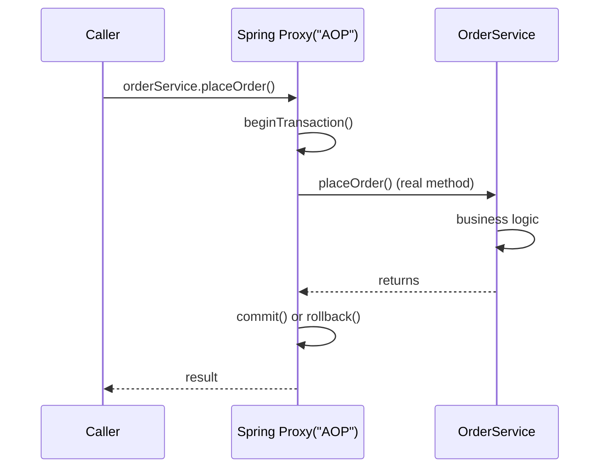

## Question

Explain Spring's declarative transaction management: how `@Transactional` is implemented with AOP proxies, the propagation behaviors (REQUIRED, REQUIRES_NEW, NESTED), isolation levels, and the common pitfall of self-invocation.

## Answer

**How `@Transactional` works (AOP proxy):**



Spring wraps your bean in a JDK dynamic proxy (or CGLIB subclass proxy). The proxy intercepts method calls, manages the transaction boundary, and delegates to the real bean.

**Propagation behaviors:**

| Propagation | Behavior |
|---|---|
| `REQUIRED` (default) | Join existing tx; create new if none |
| `REQUIRES_NEW` | Always create new tx; suspend existing |
| `NESTED` | Savepoint in existing tx; rollback to savepoint on failure |
| `SUPPORTS` | Join if exists; non-transactional if none |
| `NOT_SUPPORTED` | Suspend existing; run non-transactionally |
| `MANDATORY` | Must join existing; exception if none |
| `NEVER` | Must not run in a tx; exception if one exists |

**Isolation levels:**

| Level | Prevents |
|---|---|
| `READ_UNCOMMITTED` | Nothing |
| `READ_COMMITTED` | Dirty reads |
| `REPEATABLE_READ` | Dirty reads + non-repeatable reads |
| `SERIALIZABLE` | All anomalies (slowest) |

**Rollback rules:**
```java
@Transactional(rollbackFor = Exception.class)  // rollback on checked exceptions too
@Transactional(noRollbackFor = BusinessException.class)
```
Default: rollback only on `RuntimeException` and `Error`. Checked exceptions do NOT roll back by default — a common surprise.

**Self-invocation problem (critical pitfall):**
```java
@Service
public class OrderService {
    public void placeOrder() {
        this.sendConfirmation();  // ← calls through 'this' — bypasses proxy!
    }
    
    @Transactional
    public void sendConfirmation() {
        // This @Transactional is IGNORED — no proxy involved
    }
}
```
Fix: inject `OrderService` into itself (via `@Autowired` or `ApplicationContext.getBean()`), or move the inner method to a separate bean.

**`@Transactional` on private methods:** Silently ignored (CGLIB proxies can't intercept private methods). Must be public.

**Transaction propagation example:**
```java
@Service
public class PaymentService {
    @Transactional(propagation = REQUIRES_NEW)  
    public void chargeCard(...) { ... }  // always its own tx — won't roll back with caller
}
```

## Follow-ups

- What is the difference between `JpaTransactionManager` and `DataSourceTransactionManager`?
- How does `@TransactionalEventListener` differ from `@EventListener` for transaction-aware events?
- What is an "optimistic lock" exception (`ObjectOptimisticLockingFailureException`) in Spring Data?
