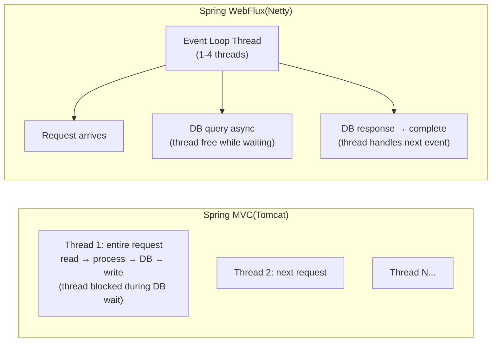

## Question

Compare Spring MVC (blocking) with Spring WebFlux (reactive non-blocking): the threading model, `Mono<T>` and `Flux<T>` types, functional routing, and when to choose WebFlux over MVC.

## Answer

**Threading model comparison:**



**Spring MVC:** One thread per request. Thread blocks during I/O (DB, HTTP calls). With 200 threads → max 200 concurrent requests. Simple model; easy debugging.

**Spring WebFlux:** Event-loop (Netty or Undertow). Threads never block — callbacks called on I/O completion. Hundreds of thousands of concurrent connections with ~equal to CPU count threads.

**`Mono<T>` and `Flux<T>`:**
```java
// Mono: 0 or 1 item
Mono<User> findById(Long id);

// Flux: 0 to N items
Flux<Order> findByCustomerId(Long customerId);
```

**Controller (annotation-based WebFlux):**
```java
@RestController
@RequestMapping("/api/users")
public class UserController {
    
    @GetMapping("/{id}")
    public Mono<ResponseEntity<UserDTO>> getUser(@PathVariable Long id) {
        return userService.findById(id)
            .map(user -> ResponseEntity.ok(toDTO(user)))
            .defaultIfEmpty(ResponseEntity.notFound().build());
    }
    
    @GetMapping
    public Flux<UserDTO> listUsers() {
        return userService.findAll()
            .map(this::toDTO);
    }
    
    @PostMapping
    @ResponseStatus(HttpStatus.CREATED)
    public Mono<UserDTO> createUser(@RequestBody @Valid Mono<CreateUserRequest> request) {
        return request.flatMap(userService::create).map(this::toDTO);
    }
}
```

**Functional routing (alternative to annotations):**
```java
@Bean
public RouterFunction<ServerResponse> routes(UserHandler handler) {
    return route(GET("/api/users/{id}"), handler::getUser)
          .andRoute(GET("/api/users"), handler::listUsers)
          .andRoute(POST("/api/users"), handler::createUser);
}
```

**Reactive data access:** `spring-data-r2dbc` (non-blocking SQL), `spring-data-mongodb` (reactive MongoDB).

**When to choose WebFlux:**
✅ High I/O concurrency (streaming, chat, real-time).
✅ Microservices making many downstream HTTP calls.
✅ WebSocket / SSE (Server-Sent Events).
❌ CPU-bound work (no benefit, added complexity).
❌ Teams unfamiliar with reactive programming.
❌ Blocking dependencies (JDBC drivers) — blocks event loop.

## Follow-ups

- How does `WebClient` differ from `RestTemplate` for making HTTP calls in a reactive context?
- What is `flatMap` vs `map` in Project Reactor and when do you use each?
- How do you handle errors in a reactive pipeline? (`onErrorReturn`, `onErrorResume`, `doOnError`)
